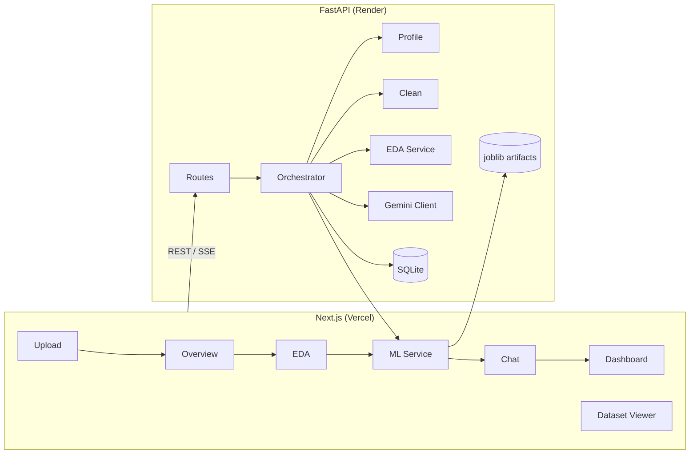

# AI Data Analyst

[](https://github.com/yartsun-m/ai-data-analyst-app/actions/workflows/ci.yml)

**Live demo:** [Frontend (Vercel)](https://ai-data-analyst-app-sigma.vercel.app) · [Backend API (Render)](https://ai-data-analyst-app-w3cu.onrender.com/docs)

Production-style full-stack app: upload any tabular dataset (CSV/Excel), profile & validate it, clean it, run EDA, train ML models with cross-validation, chat with Gemini using summarized context, and export reports.

## Features

| Area | Capabilities |
|------|----------------|
| **Data** | Upload, type/role detection, Pandera + **rich quality report**, cleaning with **outlier treatment**, paginated spreadsheet viewer, CSV export |
| **EDA** | Plotly histograms, correlation heatmap, boxplots, category bars, time series, **interactive custom charts** |
| **ML** | AutoML (LR, RF, XGBoost), 3-fold CV, RandomizedSearch tuning on RF, SHAP/coefficients, residual diagnostics, model persistence, `/predict`, **mean encoding**, **MLflow** |
| **LLM** | Gemini multi-key fallback, conversation memory, streaming chat (SSE), context from stats only |
| **Ops** | SQLite session persistence, background training jobs, structured logging, rate limiting, Prometheus `/metrics`, Docker healthchecks, CI + Playwright E2E |
| **MLOps** | MLflow experiment tracking (local file store), mean encoding, outlier treatment, clustering, anomaly detection |
| **AI** | LLM tool calling (stats/correlations/ML), keyword RAG over artifacts, streaming chat |

## Architecture



**Data flow:** Upload stores file on disk + session in SQLite → each step updates session JSON → ML saves fitted `Pipeline` to `data/models/` → LLM receives aggregates only (never raw rows).

## Tech Stack

| Layer | Stack |
|-------|-------|
| Backend | Python 3.11, FastAPI, Pandas, scikit-learn, XGBoost, SHAP, Pandera, joblib, Gemini API, SQLite |
| Frontend | Next.js 15, TypeScript, Tailwind, Plotly.js |
| DevOps | Docker, GitHub Actions CI, Vercel + Render |

## Quick Start (Docker)

```bash
cp .env.example .env
# Set GEMINI_API_KEYS for LLM chat (optional)
docker compose up --build
```

- Frontend: http://localhost:3000
- API docs: http://localhost:8000/docs
- LLM health: http://localhost:8000/health/llm

## Example Workflows

### 1. Sales classification (`sample-data/sales_sample.csv`)
1. Upload → Overview → Run Cleaning
2. EDA → inspect region/category charts
3. ML → target `region` → train (async job polls automatically)
4. Chat → *"Which features matter most?"*
5. Dashboard → download HTML report

### 2. Product pricing regression (`sample-data/products-1000.csv`)
1. Upload → target `Price`
2. ML → expect negative R² warning (price not predictable from metadata)
3. Review cross-validation + aggregated feature importance by column
4. Export cleaned CSV from Overview

### 3. Customer exploration (`sample-data/customers-1000.csv`)
1. Upload → validation report flags identifier columns
2. Use **Data** page for full paginated browse
3. ML → target `Country` (classification)

## API Endpoints

| Method | Path | Description |
|--------|------|-------------|
| POST | `/upload` | Upload CSV/Excel, profile + validate |
| GET | `/profile` | Profile (optional `target_column`) |
| GET | `/dataset` | Paginated dataset viewer |
| GET | `/export` | Download raw/cleaned CSV |
| POST | `/clean` | Cleaning pipeline (`outlier_strategy`: none/clip/winsorize/remove) |
| GET | `/eda` | EDA charts |
| POST | `/eda/custom` | Interactive chart (x/y columns) |
| POST | `/clustering` | K-Means + PCA scatter |
| POST | `/anomaly` | Isolation Forest detection |
| POST | `/train` | Start async training (`async_mode: true`) |
| GET | `/train/status` | Poll training job |
| POST | `/predict` | Score rows with saved model |
| POST | `/ask` | LLM Q&A (`stream: true` for SSE) |
| GET | `/dashboard` | Dashboard JSON |
| GET | `/report` | HTML report download |
| GET | `/health` | Health check |
| GET | `/health/llm` | Gemini key probe |
| GET | `/metrics` | Prometheus metrics |

See also: [Case study — negative R² on products-1000](docs/CASE_STUDY.md)

## Environment Variables

### Backend (Render)

| Variable | Description |
|----------|-------------|
| `GEMINI_API_KEYS` | Comma-separated AI Studio keys |
| `GEMINI_MODELS` | Model priority list |
| `CORS_ORIGINS` | Frontend URL(s) |
| `CV_FOLDS` | Cross-validation folds (default 3) |
| `ENABLE_HYPERPARAMETER_TUNING` | RF RandomizedSearch (default true) |

### Frontend (Vercel)

| Variable | Description |
|----------|-------------|
| `NEXT_PUBLIC_API_URL` | Backend URL (no trailing slash) |

## Testing

```bash
cd backend
pip install -r requirements-dev.txt
pytest -q

# Playwright API E2E (backend must be running)
npm install
npx playwright install chromium
API_URL=http://localhost:8000 npm run test:e2e
```

CI runs backend pytest, Playwright API demo, and frontend build on every push to `main`.

## Deployment

| Service | Platform | Notes |
|---------|----------|-------|
| Frontend | Vercel | Set `NEXT_PUBLIC_API_URL`, redeploy after changes |
| Backend | Render | Set `GEMINI_*`, `CORS_ORIGINS`; mount disk at `/app/data` for persistence |

## Project Structure

```
backend/app/
  api/routes/     # FastAPI endpoints
  services/       # Business logic + jobs + validation
  ml/             # Explainability, encoders
  llm/            # Gemini client, context builder
  db/             # SQLite persistence
  middleware/     # Logging, rate limits
frontend/src/app/ # Upload, Overview, Data, EDA, ML, Chat, Dashboard
```

## License

MIT — see [LICENSE](LICENSE).
